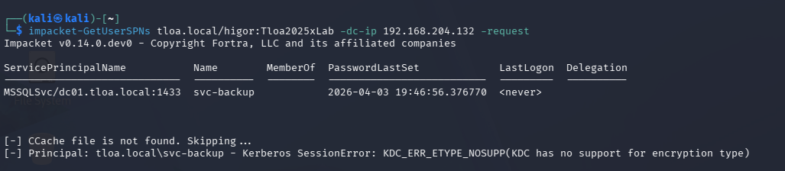
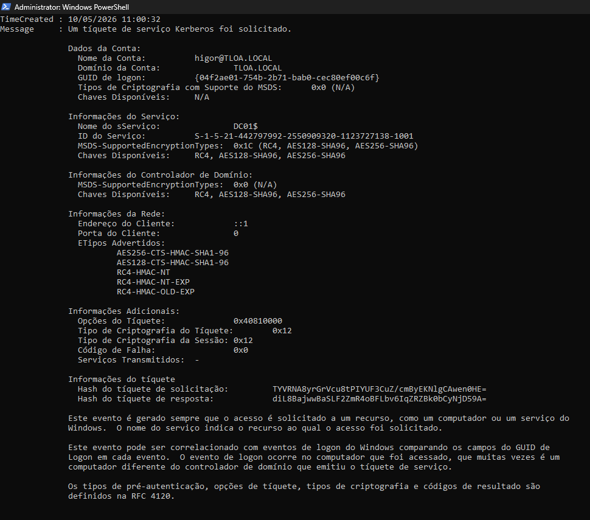
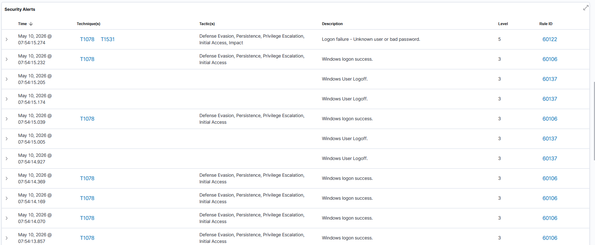

# Incident Response Report — Case 002

**Case ID:** TLOA-IR-2026-02
**Date:** 2026-05-10
**Analyst:** Higor Silva
**Environment:** TLOA Lab (`tloa.local`)
**Severity:** High
**Status:** Closed

---

## 1. Executive Summary

On May 10, 2026, a Kerberoasting attack was attempted against the `tloa.local` domain from an external attacker machine (Kali Linux). The adversary authenticated to the domain using a valid low-privileged account (`higor@TLOA.LOCAL`) and requested a Kerberos service ticket (TGS) for the `svc-backup` service account, which holds a registered Service Principal Name (SPN). The attack tool (Impacket `GetUserSPNs.py`) reported a failure due to encryption type incompatibility — the tool attempted to request an RC4-encrypted ticket, which Windows Server 2025 does not issue by default. However, forensic analysis of the Domain Controller event logs confirmed that the KDC did issue an AES256-encrypted ticket, meaning the attack partially succeeded at the protocol level. The failure was a tooling limitation, not a security control. No automated detection was triggered by Wazuh SIEM during the attack. The `svc-backup` account remains a high-value target due to its registered SPN and should be hardened.

---

## 2. Incident Details

| Field | Details |
|---|---|
| **Detection Source** | Manual investigation — DC Event Viewer (Event ID 4769) |
| **Affected Host(s)** | `DC01 (192.168.204.132)` |
| **Affected Account(s)** | `tloa\svc-backup` (SPN: `MSSQLSvc/dc01.tloa.local:1433`) |
| **Attacker Account Used** | `higor@TLOA.LOCAL` (low-privileged domain user) |
| **Attack Vector** | Kerberos TGS request from authenticated domain user (Kali Linux) |
| **Initial Symptom** | Impacket error `KDC_ERR_ETYPE_NOSUPP` on attacker terminal |
| **Initial Detection** | 2026-05-10 11:00 UTC-3 (Event ID 4769 on DC01) |
| **Containment Time** | N/A — no active compromise confirmed; hardening recommended |

---

## 3. Timeline

| Timestamp (UTC-3) | Event | Source |
|---|---|---|
| 2026-05-10 07:54:14 | First authentication attempt using `jsmith:Password123` — logon failure (bad password) | Wazuh Rule 60122 / Event ID 4625 |
| 2026-05-10 07:54:14 | Multiple logon success and logoff events for `higor@TLOA.LOCAL` | Wazuh Rule 60106 / Event ID 4624 |
| 2026-05-10 11:00:32 | Impacket `GetUserSPNs.py` enumerated SPN — `svc-backup` identified as Kerberoastable target | DC01 Event ID 4769 |
| 2026-05-10 11:00:32 | KDC received TGS request for `svc-backup` — issued AES256 ticket (0x12) instead of requested RC4 | DC01 Event ID 4769 |
| 2026-05-10 11:00:32 | Impacket reported `KDC_ERR_ETYPE_NOSUPP` — tool could not process AES256 ticket for offline cracking | Attacker terminal |
| 2026-05-10 11:00:32 | No Wazuh alert generated for Kerberoasting activity | Wazuh — absence of detection |
| 2026-05-10 11:05:00 | Manual review of DC01 Event Viewer confirmed TGS issuance via Event ID 4769 | Analyst investigation |

---

## 4. ATT&CK Mapping

| Tactic | Technique | ID | Method Used |
|---|---|---|---|
| Credential Access | Steal or Forge Kerberos Tickets: Kerberoasting | T1558.003 | Impacket `GetUserSPNs.py` |
| Discovery | Account Discovery: Domain Account | T1087.002 | SPN enumeration via LDAP |
| Initial Access / Persistence | Valid Accounts | T1078 | Low-privileged domain account `higor@TLOA.LOCAL` |

> 🔗 [View on MITRE ATT&CK Navigator](https://mitre-attack.github.io/attack-navigator/)

---

## 5. Technical Analysis

### 5.1 Attack Description

The attacker executed a Kerberoasting attack using Impacket's `GetUserSPNs.py` from a Kali Linux machine. Kerberoasting abuses the Kerberos protocol by requesting service tickets (TGS) for accounts with registered SPNs, then attempting to crack the ticket offline to recover the service account's plaintext password.

**Step 1 — Initial failed attempt (wrong credentials):**
```bash
impacket-GetUserSPNs tloa.local/jsmith:Password123 -dc-ip 192.168.204.132 -request
# Result: invalidCredentials — bad password for jsmith
```

**Step 2 — Successful authentication and SPN enumeration:**
```bash
impacket-GetUserSPNs tloa.local/higor:Tloa2025xLab -dc-ip 192.168.204.132 -request
# Result: svc-backup identified with SPN MSSQLSvc/dc01.tloa.local:1433
```

**Step 3 — TGS request and encryption mismatch:**

The tool requested an RC4-HMAC encrypted ticket. Windows Server 2025 has deprecated RC4 by default and the KDC instead issued an AES256-CTS-HMAC-SHA1-96 ticket (encryption type `0x12`). Impacket reported `KDC_ERR_ETYPE_NOSUPP` because it could not process the AES256 ticket for offline cracking in its current configuration.

**Critical finding:** Event ID 4769 on DC01 confirms the ticket WAS issued:
- `Ticket Encryption Type: 0x12` (AES256)
- `Failure Code: 0x0` (no failure — ticket successfully issued)
- `Client Address: ::1`

This means the attack partially succeeded at the protocol level. An attacker using a tool capable of handling AES256 tickets (updated Rubeus or Impacket with AES support) could potentially obtain the ticket and attempt offline cracking.

### 5.2 Evidence

**Impacket output — KDC_ERR_ETYPE_NOSUPP error and svc-backup SPN enumeration:**


**DC01 Event ID 4769 — TGS ticket issued in AES256:**


**Wazuh Security Alerts — logon events captured, no Kerberoasting alert:**


### 5.3 Artifacts

| Artifact Type | Value / Location |
|---|---|
| Target Account | `tloa\svc-backup` |
| SPN | `MSSQLSvc/dc01.tloa.local:1433` |
| Attacker Account | `higor@TLOA.LOCAL` |
| Attacker Host | Kali Linux (`192.168.204.x`) |
| Event ID | 4769 — Kerberos Service Ticket Request (DC01 Security Log) |
| Ticket Encryption Type | `0x12` — AES256-CTS-HMAC-SHA1-96 |
| Failure Code | `0x0` — ticket issued successfully |
| Tool Used | Impacket `GetUserSPNs.py` v0.14.0 |
| MSDS-SupportedEncryptionTypes (svc-backup) | `0x1C` — RC4, AES128, AES256 |

---

## 6. Detection Analysis

### What Was Detected ✅

| Detection | Rule / Method | Confidence |
|---|---|---|
| Failed logon attempt (`jsmith` bad password) | Wazuh Rule 60122 / Event ID 4625 (T1078 + T1531) | High — correctly flagged |
| Logon success for `higor@TLOA.LOCAL` | Wazuh Rule 60106 / Event ID 4624 (T1078) | Medium — expected behavior for authenticated user, no Kerberoasting context |

### What Was NOT Detected ❌

| Gap | Reason | Recommendation |
|---|---|---|
| Kerberoasting TGS request for `svc-backup` | No Wazuh rule configured for Event ID 4769 with SPN enumeration pattern | Create Wazuh rule for Event ID 4769 filtering on non-machine accounts and AES/RC4 ticket requests |
| SPN enumeration via LDAP | No LDAP query monitoring configured | Enable LDAP signing audit and monitor for bulk SPN queries from non-admin accounts |
| AES256 ticket issued to attacker | Wazuh does not correlate 4769 events with known Kerberoastable accounts | Build detection logic correlating 4769 events against a list of monitored service accounts |

> **Key takeaway:** The Kerberoasting activity generated Event ID 4769 on the DC but produced zero Wazuh alerts. The attack was only identified through manual forensic investigation of the DC event logs. In a real environment, this would represent a complete detection failure — the attacker would have the AES256 ticket and no SOC alert would have fired.

---

## 7. Containment & Eradication

- [x] Confirmed no RC4 ticket was issued (Windows Server 2025 RC4 deprecation effective)
- [x] Confirmed AES256 ticket was issued but not successfully processed by attacker tool
- [x] No credential compromise confirmed at this time
- [ ] Rotate `svc-backup` password to a long, random string (25+ characters) to resist offline cracking
- [ ] Evaluate removal of SPN from `svc-backup` if MSSQL service is not actively used in lab
- [ ] Implement Group Managed Service Account (gMSA) to eliminate manual password management for service accounts
- [ ] Configure Wazuh rule for Event ID 4769 monitoring

---

## 8. Root Cause Analysis

Two root causes enabled this attack to progress as far as it did:

**1. Kerberoastable service account configuration:** `svc-backup` has a registered SPN (`MSSQLSvc/dc01.tloa.local:1433`) and supports multiple encryption types including RC4 (`MSDS-SupportedEncryptionTypes: 0x1C`). Any authenticated domain user can request a TGS for this account, which is by design in Kerberos but creates an offline cracking opportunity.

**2. Absence of detection for Event ID 4769:** Wazuh had no rule configured to alert on TGS requests targeting service accounts. Event ID 4769 is a standard Kerberos audit event that, when correlated with known Kerberoastable accounts, provides reliable detection of this attack pattern. The absence of this rule meant the attack was completely invisible to the SIEM.

The RC4 deprecation in Windows Server 2025 acted as an unintentional partial control — it prevented the specific Impacket version used from processing the ticket — but this is not a reliable security control, as modern tooling handles AES256 Kerberoasting.

---

## 9. Lessons Learned

### Detection Improvements
- Configure Wazuh to ingest and alert on Event ID 4769 from DC01 Security Log
- Create a detection rule filtering 4769 events where the target account is a known service account (not a machine account ending in `$`)
- Alert on bulk 4769 events from a single source within a short time window (SPN enumeration pattern)
- Consider Honey SPN — a fake service account with SPN that should never receive a TGS request; any 4769 for this account is an immediate high-confidence alert

### Hardening Recommendations
- Set `svc-backup` password to 25+ random characters — makes AES256 offline cracking computationally infeasible
- Restrict `svc-backup` to AES256 only by setting `MSDS-SupportedEncryptionTypes` to `0x18` — removes RC4 support at the account level
- Migrate service accounts to Group Managed Service Accounts (gMSA) — passwords are 120 characters, auto-rotated, uncrackable
- Audit all accounts with SPNs in the domain regularly: `Get-ADUser -Filter {ServicePrincipalName -ne "$null"} -Properties ServicePrincipalName`

### Lab Improvements
- Add Event ID 4769 to Wazuh monitored events on DC01
- Test detection after rule update by re-running this case
- Try Kerberoasting with Rubeus or updated Impacket to confirm AES256 ticket is obtainable and test cracking resistance with `hashcat`

---

## 10. References

- [MITRE ATT&CK T1558.003 — Kerberoasting](https://attack.mitre.org/techniques/T1558/003/)
- [MITRE ATT&CK T1087.002 — Account Discovery: Domain Account](https://attack.mitre.org/techniques/T1087/002/)
- [Microsoft — Event ID 4769: A Kerberos service ticket was requested](https://learn.microsoft.com/en-us/windows/security/threat-protection/auditing/event-4769)
- [Impacket — GetUserSPNs.py](https://github.com/fortra/impacket/blob/master/examples/GetUserSPNs.py)
- [SpecterOps — Kerberoasting Revisited](https://posts.specterops.io/kerberoasting-revisited-d434351bd4d1)
- [Microsoft — RC4 Deprecation in Windows Server 2025](https://techcommunity.microsoft.com/t5/windows-server-news-and-best/rc4-deprecation-in-windows-server-2025/ba-p/4168184)
- [Wazuh SIEM Documentation](https://documentation.wazuh.com/)

---

*Report generated as part of the TLOA Lab — Threat Lab Offensive Architecture*
*All activity performed in an isolated lab environment for educational purposes.*
