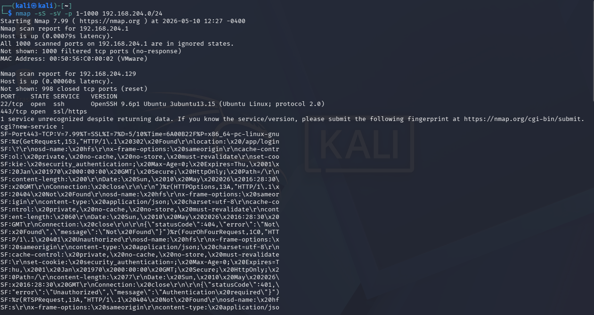
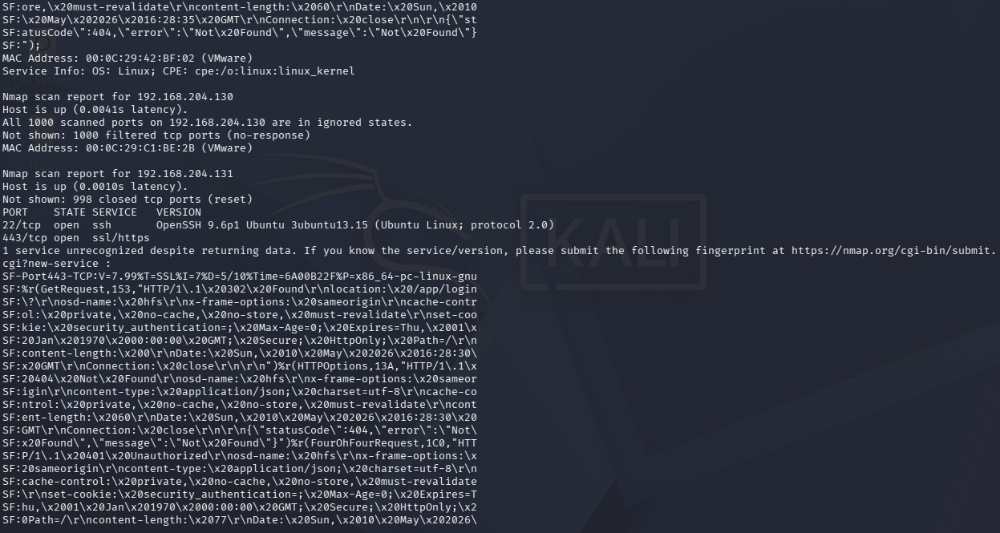
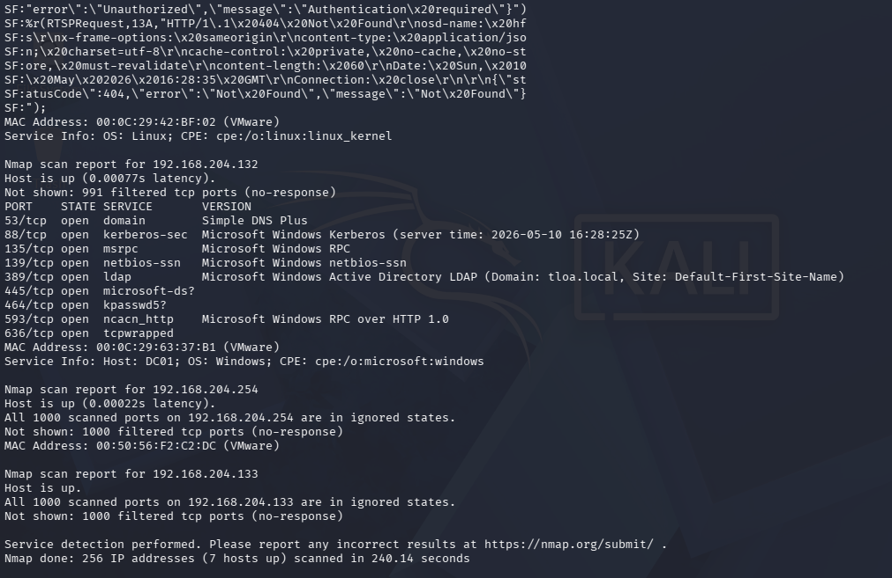
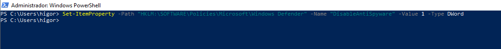
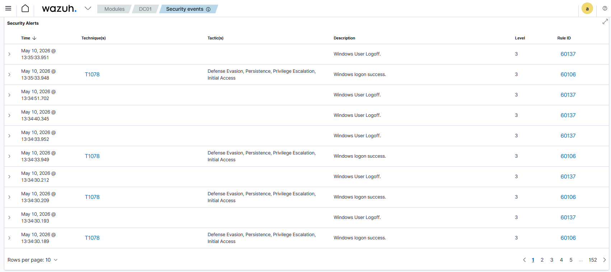

# Incident Response Report — Case 003

**Case ID:** TLOA-IR-2026-03
**Date:** 2026-05-10
**Analyst:** Higor Silva
**Environment:** TLOA Lab (`tloa.local`)
**Severity:** High
**Status:** Closed

---

## 1. Executive Summary

On May 10, 2026, two distinct adversarial techniques were executed against the `tloa.local` lab environment. First, a network reconnaissance scan was performed from a Kali Linux attacker machine against the entire `192.168.204.0/24` subnet, successfully mapping all live hosts and exposed services — including a full service fingerprint of the Domain Controller (`DC01`). Second, a registry modification was executed on the Windows 10 target host to disable Windows Defender antispyware protection by setting a policy key under `HKLM\SOFTWARE\Policies\Microsoft\Windows Defender`. Both techniques are commonly chained by threat actors during the post-compromise phase: network discovery to identify lateral movement targets, followed by defense evasion to reduce detection capability before advancing the attack. Neither technique generated a dedicated Wazuh SIEM alert, representing significant detection gaps in the current lab configuration. Detection was confirmed only through manual investigation.

---

## 2. Incident Details

| Field | Details |
|---|---|
| **Detection Source** | Manual investigation — nmap output and registry enumeration |
| **Affected Host(s)** | All hosts on `192.168.204.0/24` subnet (scan); `WIN10-TARGET` (registry modification) |
| **Affected Account(s)** | `higor@TLOA.LOCAL` (scan); local Administrator (registry modification) |
| **Attack Vector** | Network-level reconnaissance + local registry modification |
| **Initial Symptom** | No automated detection — discovered during lab exercise |
| **Execution Time** | 2026-05-10 12:27 UTC-4 (nmap); 2026-05-10 ~12:35 UTC-4 (registry) |
| **Containment Time** | 2026-05-10 13:40 UTC-3 (registry key removed) |

---

## 3. Timeline

| Timestamp | Event | Source |
|---|---|---|
| 2026-05-10 12:27 | Nmap SYN scan initiated from Kali Linux against `192.168.204.0/24` (ports 1-1000) | Attacker terminal |
| 2026-05-10 12:27 | `192.168.204.1` identified — VMware gateway, all ports filtered | Nmap output |
| 2026-05-10 12:27 | `192.168.204.129` identified — Linux host, SSH (22) and HTTPS (443) open | Nmap output |
| 2026-05-10 12:27 | `192.168.204.130` identified — host up, all ports filtered | Nmap output |
| 2026-05-10 12:27 | `192.168.204.131` identified — Linux host, SSH (22) and HTTPS (443) open | Nmap output |
| 2026-05-10 12:27 | `192.168.204.132` identified — DC01, full AD service fingerprint obtained (DNS, Kerberos, LDAP, SMB, RPC) | Nmap output |
| 2026-05-10 12:27 | OS fingerprint confirmed: `DC01; OS: Windows` | Nmap output |
| 2026-05-10 ~12:35 | Registry modification executed on WIN10-TARGET: `DisableAntiSpyware = 1` under `HKLM\SOFTWARE\Policies\Microsoft\Windows Defender` | PowerShell / Attacker |
| 2026-05-10 13:35 | Wazuh reviewed — no dedicated alerts for scan or registry modification detected | Wazuh Security Events |
| 2026-05-10 13:40 | Registry key removed — Windows Defender protection restored | Analyst / PowerShell |

---

## 4. ATT&CK Mapping

| Tactic | Technique | ID | Method Used |
|---|---|---|---|
| Discovery | Network Service Discovery | T1046 | Nmap 7.99 SYN scan (`-sS -sV`) against `192.168.204.0/24` |
| Defense Evasion | Modify Registry | T1112 | `Set-ItemProperty` — `DisableAntiSpyware = 1` under Windows Defender policy key |

> 🔗 [View on MITRE ATT&CK Navigator](https://mitre-attack.github.io/attack-navigator/)

---

## 5. Technical Analysis

### 5.1 Attack Description

**Phase 1 — Network Reconnaissance (T1046)**

The attacker executed a TCP SYN scan with service version detection against the full lab subnet to map the network topology and identify available attack targets.

```bash
nmap -sS -sV -p 1-1000 192.168.204.0/24
```

**Hosts discovered:**

| IP | Status | Open Ports / Services |
|---|---|---|
| `192.168.204.1` | Up | All filtered (VMware gateway) |
| `192.168.204.129` | Up | 22/tcp SSH, 443/tcp HTTPS (Linux) |
| `192.168.204.130` | Up | All filtered |
| `192.168.204.131` | Up | 22/tcp SSH, 443/tcp HTTPS (Linux) |
| `192.168.204.132` | Up | 53 DNS, 88 Kerberos, 135 RPC, 139 NetBIOS, 389 LDAP, 445 SMB, 464 kpasswd, 593 RPC-HTTP, 636 tcpwrapped — **DC01** |
| `192.168.204.254` | Up | All filtered (VMware) |

The DC01 fingerprint is particularly valuable from an attacker's perspective — LDAP (389) and Kerberos (88) confirm Active Directory presence, SMB (445) indicates potential lateral movement paths, and DNS (53) can be abused for domain enumeration.

**Phase 2 — Defense Evasion via Registry Modification (T1112)**

Following reconnaissance, the attacker modified the Windows Defender policy registry key to disable antispyware protection, reducing the likelihood of subsequent payloads being detected.

```powershell
Set-ItemProperty -Path "HKLM:\SOFTWARE\Policies\Microsoft\Windows Defender" `
  -Name "DisableAntiSpyware" -Value 1 -Type DWord
```

**Registry artifact:**

| Field | Value |
|---|---|
| Key | `HKLM\SOFTWARE\Policies\Microsoft\Windows Defender` |
| Value Name | `DisableAntiSpyware` |
| Value Data | `1` (disabled) |
| Value Type | `REG_DWORD` |

This key is a Group Policy-enforced setting. Setting it to `1` instructs Windows to disable the antispyware engine regardless of the Windows Security Center state, silently reducing endpoint protection without visible UI indication to the user.

### 5.2 Evidence

**Nmap scan output — hosts 192.168.204.1 and 192.168.204.129:**


**Nmap scan output — hosts 192.168.204.130 and 192.168.204.131:**


**Nmap scan output — DC01 (192.168.204.132) full service fingerprint:**


**PowerShell — registry modification DisableAntiSpyware = 1:**


**Wazuh Security Alerts — no dedicated alert for scan or registry modification:**


### 5.3 Artifacts

| Artifact Type | Value / Location |
|---|---|
| Attacker Host | Kali Linux (lab network `192.168.204.x`) |
| Scan Tool | Nmap 7.99 |
| Scan Target | `192.168.204.0/24` — ports 1-1000 |
| DC01 Services Exposed | DNS (53), Kerberos (88), RPC (135), NetBIOS (139), LDAP (389), SMB (445), kpasswd (464) |
| Registry Key Modified | `HKLM\SOFTWARE\Policies\Microsoft\Windows Defender` |
| Registry Value | `DisableAntiSpyware = 1 (REG_DWORD)` |
| Target Host | `WIN10-TARGET` |
| Method | PowerShell `Set-ItemProperty` |

---

## 6. Detection Analysis

### What Was Detected ✅

| Detection | Rule / Method | Confidence |
|---|---|---|
| T1078 logon/logoff events during lab session | Wazuh Rule 60106 / 60137 | Low — routine authentication noise, no attack context |

### What Was NOT Detected ❌

| Gap | Reason | Recommendation |
|---|---|---|
| Network scan from Kali (T1046) | No network-level IDS/IPS configured (no Suricata or Zeek) | Deploy Suricata on the network segment — nmap SYN scans generate distinctive packet patterns detectable via IDS signatures |
| Port scan against DC01 | Wazuh has no rule for high-volume inbound connection attempts | Enable Windows Firewall audit logging and create Wazuh rule for repeated connection failures from single source |
| Registry modification of `DisableAntiSpyware` (T1112) | No Wazuh FIM rule configured for `HKLM\SOFTWARE\Policies\Microsoft\Windows Defender` | Configure Wazuh File Integrity Monitoring (FIM) for Windows Defender policy registry keys |
| Sysmon EID 13 for registry value set | Sysmon config may not include this registry path in monitoring scope | Add `HKLM\SOFTWARE\Policies\Microsoft\Windows Defender` to Sysmon EID 13 rules |

> **Key takeaway:** Both techniques executed without generating a single dedicated security alert. The network scan was completely invisible at the host level — no host-based agent can detect network traffic not destined for it. The registry modification highlights the same gap identified in Case 001: Run key writes were also undetected. Registry monitoring via Sysmon EID 13 and Wazuh FIM is a critical missing control across the entire lab environment.

---

## 7. Containment & Eradication

- [x] Identified registry modification via PowerShell investigation
- [x] Removed `DisableAntiSpyware` registry value — Windows Defender protection restored
- [x] Confirmed no additional Defender policy keys were modified
- [x] No active compromise confirmed beyond defense evasion setup
- [ ] Deploy Suricata on lab network for network-level detection coverage
- [ ] Add Sysmon EID 13 rules for Windows Defender policy registry paths
- [ ] Configure Wazuh FIM for critical registry paths

---

## 8. Root Cause Analysis

**T1046 — Network Scan:**
The lab has no network-level detection capability. Wazuh agents are host-based and cannot observe network traffic between hosts. A network scan from Kali to DC01 generates no telemetry on any monitored endpoint because the SYN packets are processed at the network stack level before any host-based agent intercepts them. Without a network IDS (Suricata, Zeek, or Snort) deployed inline or in span/mirror mode, network reconnaissance is entirely blind to the current detection stack.

**T1112 — Registry Modification:**
The same root cause identified in Case 001 applies here — no Sysmon EID 13 rules and no Wazuh FIM coverage for registry paths outside the Run keys. The Windows Defender policy path (`HKLM\SOFTWARE\Policies\Microsoft\Windows Defender`) is a high-value target for defense evasion and should be monitored with high-priority alerting. The absence of coverage allowed the modification to persist undetected until manual investigation.

---

## 9. Lessons Learned

### Detection Improvements
- Deploy Suricata on the lab network (inline or mirror mode) to detect nmap SYN scans via signatures like `ET SCAN Nmap Scripting Engine`
- Add Sysmon EID 13 rules targeting `HKLM\SOFTWARE\Policies\Microsoft\Windows Defender` and all subkeys
- Configure Wazuh FIM for Windows Defender registry paths with Level 10+ alerting
- Create a Wazuh rule correlating high-frequency connection attempts from a single source IP against multiple ports (port scan behavioral detection)

### Hardening Recommendations
- Restrict write access to `HKLM\SOFTWARE\Policies\Microsoft\Windows Defender` to SYSTEM only
- Enable Windows Defender Tamper Protection to prevent registry-based disabling
- Segment the attacker network from the target network — limit lateral reachability
- Implement network-level firewall rules restricting port scanning between lab segments

### Lab Improvements
- Add Suricata to the Ubuntu host (`192.168.204.129`) in network monitor mode
- Expand Sysmon config (`sysmonconfig.xml`) to include EID 13 rules for all critical registry paths
- Re-run Case 003 techniques after implementing Suricata to validate detection coverage
- Document expected baseline of open ports per host for anomaly detection reference

---

## 10. References

- [MITRE ATT&CK T1046 — Network Service Discovery](https://attack.mitre.org/techniques/T1046/)
- [MITRE ATT&CK T1112 — Modify Registry](https://attack.mitre.org/techniques/T1112/)
- [Nmap Reference Guide](https://nmap.org/book/man.html)
- [Sysmon Event ID 13 — RegistryEvent (Value Set)](https://www.ultimatewindowssecurity.com/securitylog/encyclopedia/event.aspx?eventid=90013)
- [Wazuh FIM — Registry Monitoring](https://documentation.wazuh.com/current/user-manual/capabilities/file-integrity/fim-configuration.html)
- [Suricata IDS Documentation](https://suricata.readthedocs.io/)
- [Microsoft — Tamper Protection for Windows Defender](https://learn.microsoft.com/en-us/microsoft-365/security/defender-endpoint/prevent-changes-to-security-settings-with-tamper-protection)
- [Wazuh SIEM Documentation](https://documentation.wazuh.com/)

---

*Report generated as part of the TLOA Lab — Threat Lab Offensive Architecture*
*All activity performed in an isolated lab environment for educational purposes.*
